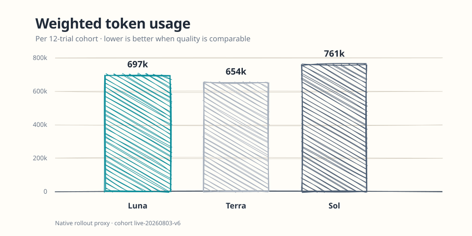
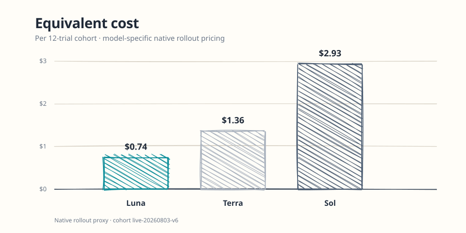
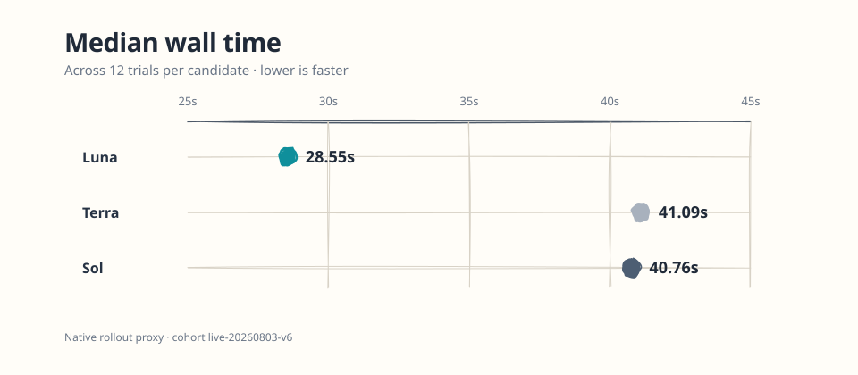

# pilotfish-codex

Codex-native role orchestration inspired by
[Pilotfish](https://github.com/Nanako0129/pilotfish). This is an independent
Codex CLI adaptation maintained by Miyago.

## Contents

- [Native target](#native-target)
- [Roles](#roles)
- [Routing evidence](#routing-evidence)
- [Plan readiness](#plan-readiness)
- [Outcome verification](#outcome-verification)
- [Continuation across user input](#continuation-across-user-input)
- [Installation](#installation)
  - [Give it to an AI agent](#give-it-to-an-ai-agent)
  - [Run it yourself](#run-it-yourself)
- [Native verification](#native-verification)
- [Development](#development)
- [License](#license)

## Native target

Pilotfish-Codex targets only Codex `rust-v0.146.0`. The native Multi-Agent
configuration is:

```toml
[agents]
enabled = true
max_concurrent_threads_per_session = 3
```

Three is the child concurrency limit: one root and up to three children. The
active configuration does not emit the retired `features.multi_agent_v2`
table, adapter namespace/metadata keys, or `agents.max_threads`.
Lower and higher Codex versions fail closed; the installer never selects an
adapter route.

## Roles

The installed manifest is exactly these seven TOML roles:

- `executor`
- `mech-executor`
- `plan-verifier`
- `scout`
- `security-executor`
- `security-reviewer`
- `verifier`

Role TOMLs own their model and reasoning effort. The global policy owns typed
role delegation, approval boundaries, and fresh-context verification. The
Claude-specific `Explore` compatibility override is not installed.

The default root session uses Luna at `medium`; Plan mode and outcome
verification use Luna at `xhigh`. Terra is not installed. Sol stays at `high`
for security review/execution and the existing risk-triggered Plan review.
Mechanical roles retain their existing Luna low/medium bindings; the review
trigger and its two-`REVISE` budget are unchanged.

## Routing evidence

The current decision uses the checked-in
[36-trial v6 aggregate](./docs/benchmarks/usage-routing-v1/live-v6-summary.json):
Luna is the default, Sol is reserved for the existing risk-triggered Plan
review, and Terra has no active binding.

### Weighted token usage



Weighted tokens are a normalized usage signal, not a currency value. Lower is
better when the same work has comparable quality.

### Equivalent cost



### Median wall time



### What the figures support

The graphs answer one narrow question: which model should start routine work?
They put Luna first. Across the same 12-trial cohort, Luna costs $0.74 and
finishes in 28.55 seconds at the median. Terra uses 6% fewer weighted tokens,
but costs 83% more and takes 44% longer; it has no active routing binding. Sol
uses 9% more weighted tokens, costs 294% more, and takes 43% longer when used
as the direct routine worker. Making either the default spends more or waits
longer before the task has shown it needs deeper review.

That does **not** say that Luna is universally more capable. The deterministic
artifact check is evidence that Luna is a dependable routine executor here
(12/12); it is not an intelligence score. Sol's direct-execution result (5/12)
does not measure its planning ability either. The cohorts tested a fixed
artifact, not ambiguous requirements, risk discovery, or competing technical
options.

The resulting division of labour is deliberate:

1. Routine, mechanical, and ordinary execution start with Luna at `medium`.
2. The existing concrete-risk trigger asks Sol at `high` to review the Plan,
   where uncertainty, trade-offs, and failure modes matter.
3. Luna turns the bounded Plan into changes and verification, keeping Sol out
   of routine implementation calls.

This concentrates Sol usage on a smaller decision surface instead of paying
its direct-execution cost for every task. The claim that this improves planning
quality is a hypothesis until it is measured. The role-fitness cohort will
publish separate planning-quality, execution-reliability, and critical-risk
yield figures before treating the split as a quality win.

Cost and wall time are native-rollout proxy metrics. They do not measure
planning or execution quality. See the
[benchmark artifact contract](./docs/benchmarks/usage-routing-v1/) for the
cohort, metric definitions, and limitations.

## Plan readiness

Large Plans use one program envelope followed by independently approvable
execution slices. Independent review is triggered by concrete security,
irreversible or external, data, release, or cross-component acceptance risk,
not by file count or “non-trivial” alone. `REVISE` returns all known P0-P2
blockers in one pass. After two automatic revisions, the main session stops
resubmitting, dispositions each blocker as `FIX`, `DEFER`, or `REJECT`, and
asks only for unresolved high-impact or product and authority decisions.

See [Plan readiness](./docs/design.md#plan-readiness) for the design boundary.

## Outcome verification

Risk-triggered outcome verification follows primary-flow acceptance and returns
`CONFIRMED`, `REFUTED`, or `INCONCLUSIVE`. `REFUTED` requires a reproducible
P0-P2 claim blocker; lower-priority advisories remain non-blocking. The verifier
is read-and-run only, while the main session owns finding disposition and fixes.

For likely long work, the main session announces `AUTO` or `ASK`. `AUTO` adds no
version-control, publish, install, credential, destructive, external, scope, or
spending authority. Normal recovery is one targeted recheck of the original
failure plus a bounded regression; five materially changed passes are only an
emergency ceiling for high-risk P1/P2 recovery.

## Continuation across user input

The main-session policy keeps an unfinished objective active across decision
replies, steering, status questions, and pause or resume unless new input
clearly supersedes it. Before asking the user to decide, Codex records the
current phase, blocker, and resume point; after an unambiguous answer, it resumes
the same work within the existing authorization and scope instead of silently
stopping. Status or explanation requests cannot restart work gated by an
unresolved decision. An explicit user-requested pause keeps the resume point
without inventing a blocker or question and stays active until the user resumes
or clearly replaces the objective.

This is behavioral prompt policy, not deterministic Codex App or runtime
enforcement. Offline tests lock the contract text but do not prove live model
compliance.

See [Continuation liveness](./docs/design.md#continuation-liveness) for the
design boundary.

## Installation

The scripted route checks the exact CLI version, plans all writes, creates
backups, validates the staged native configuration and manifest, atomically
replaces targets, and commits a mode-`0600` sibling install-state sidecar.
Dry-run prints every primary path and creates nothing.

### Give it to an AI agent

This prompt uses only repository files and ordinary shell commands, so it can
be pasted into any coding agent that can access this checkout. It intentionally
keeps the explicit approval boundary before modifying `~/.codex`.

```text
Install Pilotfish-Codex from this repository checkout. First read INSTALL.md,
then inspect install/install.sh and install/AGENT-INSTALL.md. Run only the
documented dry-run against the Codex home you identify, report the selected
source, target path, planned writes, and backups, then stop for my explicit
approval before any real home write. After approval, use the same source to
install and validate it, trust exactly "Pilotfish automatic typed Plan-review
gate.", and report the verification result. Do not use sudo, print credentials,
delete files to bypass an installer error, or use a hook-bypass flag.

If this checkout is unavailable, ask me for an exact published release tag or
full commit SHA before fetching anything; do not assume main.
```

The reusable prompt is also available as
[INSTALL_PROMPT.md](./INSTALL_PROMPT.md). It works with Codex, Claude Code,
Cursor, Gemini CLI, and other agents without requiring vendor-specific tools.

### Run it yourself

Use the shell entrypoint from a local checkout. Run a dry-run first; a real
Codex-home write needs separate approval.

```bash
bash install/install.sh --dry-run --codex-home "$ACTIVE_CODEX_HOME"
bash install/install.sh --codex-home "$ACTIVE_CODEX_HOME"
```

For a remote install, pin both the downloaded script and its archive to the
same release tag or commit SHA. Do not pipe the mutable `main` branch into a
real home.

```bash
REF="<release-tag-or-commit-sha>"
curl -fsSL \
  "https://raw.githubusercontent.com/miyago9267/pilotfish-codex/$REF/install/install.sh" \
  | bash -s -- --ref "$REF" --dry-run --codex-home "$ACTIVE_CODEX_HOME"
```

The direct Python command remains useful for a checked-out repository:

```bash
python3 install/install.py --codex-home "$ACTIVE_CODEX_HOME"
python3 install/validate_agents.py \
  --config "$ACTIVE_CODEX_HOME/config.toml" "$ACTIVE_CODEX_HOME/agents"
```

The install also registers `hooks.json` and the automatic Plan-review hook.
After the first successful install, trust exactly `Pilotfish automatic typed
Plan-review gate.` in an interactive Codex session. Use `/hooks` when it is
available; otherwise restart a session and confirm the launch-time trust
prompt. Re-trust only when the hook definition changes. The resulting
`[hooks.state]` entry is expected and an update dry-run should report
`already up to date`.

See [INSTALL.md](./INSTALL.md) for the agent playbook and
[the install runbook](./install/AGENT-INSTALL.md) for updates, collision or
drift handling, recovery, and the separate home-write approval boundary.

## Native verification

Ordinary tests are offline. One explicit, quota-gated smoke is required to
complete the native migration. First stage an absolute, distinct, not-yet-
existing home:

```bash
python3 install/stage_smoke_home.py \
  --active-codex-home "$ACTIVE_CODEX_HOME" \
  --staged-codex-home "$STAGED_CODEX_HOME"
```

Then, after separate quota approval, launch from a clean `SMOKE_DIR` outside
the repository:

```bash
cd "$SMOKE_DIR"
LAUNCH_CAPTURE="$SMOKE_DIR/pilotfish-launch-capture.json"
printf '{"CODEX_HOME":"%s","CODEX_SQLITE_HOME":"%s","codex_cwd":"%s"}\n' \
  "$STAGED_CODEX_HOME" "$STAGED_CODEX_HOME" "$SMOKE_DIR" > "$LAUNCH_CAPTURE"
CODEX_HOME="$STAGED_CODEX_HOME" CODEX_SQLITE_HOME="$STAGED_CODEX_HOME" \
  python3 "$REPO_ROOT/install/verify_dispatch.py" --live --yes \
  --role scout --codex-home "$STAGED_CODEX_HOME" \
  --active-codex-home "$ACTIVE_CODEX_HOME" \
  --repository-root "$REPO_ROOT" --codex-cwd "$SMOKE_DIR" \
  --launch-capture "$LAUNCH_CAPTURE"
```

The verifier rejects retired `--mode` and `--all-roles` options before
authentication, quota spending, child creation, or receipt writing. It requires
one native typed `spawn_agent` with a non-empty message, known role, safe task
name, bounded fork, correlation to child activity, and observed child
`turn_context.model` plus `turn_context.effort`. Namespace is not native
evidence. `NATIVE_OK` completes the runtime gate; `SKIPPED` is incomplete and
`FAILED` blocks completion.

## Development

```bash
bun install --frozen-lockfile
bun run lint:md
python3 -m unittest discover -s tests -v
python3 -m py_compile install/install.py install/validate_agents.py \
  install/stage_smoke_home.py install/verify_dispatch.py
```

Historical adapter fixtures and specs are retained only as labeled evidence;
they are excluded from the active native acceptance gate.

## License

MIT. The original Pilotfish attribution and permission notice are retained.
