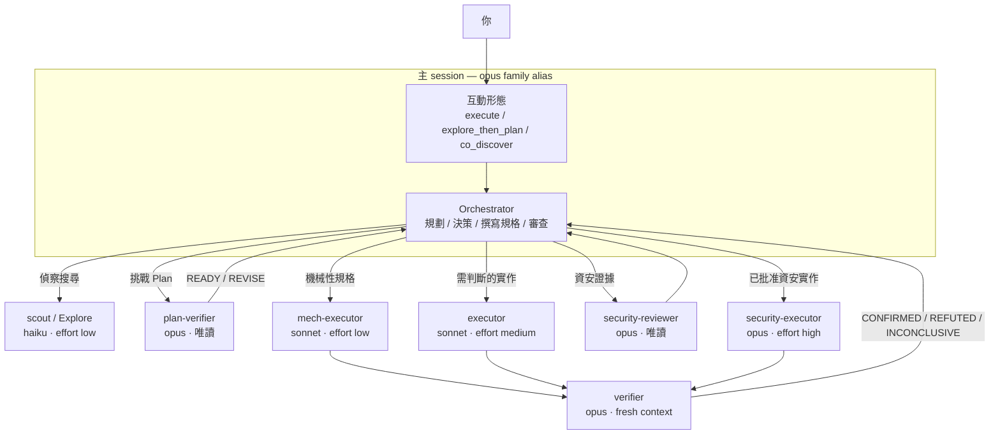

# pilotfish 🐟

> 小而快的角色 agents 處理大量工作；前沿主 session 保留規劃、批准、整合與最終判斷。

**pilotfish** 是 [Claude Code](https://code.claude.com) 的全域多模型編排政策。
新安裝以 `opus` family 作為主 session，Sonnet 與 Haiku 負責有界的執行與偵察，
風險觸發的 review 則使用全新 Opus context。它安裝的是設定，不是 runtime service，
也不會寫入你的專案。

[English](./README.md)

## 目錄

- [為什麼](#為什麼)
- [運作方式](#運作方式)
- [安裝](#安裝)
- [日常操作](#日常操作)
- [文件](#文件)
- [專案資訊](#專案資訊)

## 為什麼

Coding session 的大量 tokens 用在搜尋、重複修改、測試與文件，而不是前沿判斷。
pilotfish 把這些有界工作交給較便宜的角色，main session 仍對結果負責，並在重要
acceptance boundary 使用 fresh-context reviewer。

新安裝預設使用 `opus` alias；Fable 仍可用 `/model fable` 明確選擇。這是成本導向的
預設，不代表某個模型在所有任務都更好。理由與數據請見 [研究報告](./docs/research.zh-TW.md)、
[設計說明](./docs/design.md) 與 [#23](https://github.com/Nanako0129/pilotfish/issues/23)。

| Host 或用途 | 專案 |
|---|---|
| Claude Code 全域政策 | 本 repo |
| Claude Code 的 session-scoped GPT routing | [remora](https://github.com/Nanako0129/remora-cc) |
| Grok Build | [pilotfish-grok](https://github.com/Nanako0129/pilotfish-grok) |
| Codex CLI | [pilotfish-codex](https://github.com/miyago9267/pilotfish-codex) |

## 運作方式

| 層級 | 安裝位置 | 責任 |
|---|---|---|
| Machine | `~/.claude/settings.json` | 主模型 alias 與 fallback chain |
| Roles | `~/.claude/agents/*.md` | 每個角色的模型、effort 與 capability boundary |
| Policy | `~/.claude/CLAUDE.md` | Dispatch、approval、verification 與長跑行為 |

如果設定了 `CLAUDE_CONFIG_DIR`，以上所有 `~/.claude/` 路徑都移到該設定根目錄。



| 角色 | 模型 | Effort | 用途 |
|---|---|---|---|
| `scout` | haiku | low | 唯讀 repo 偵察 |
| `Explore` | haiku | low | 不繼承主模型的廣域唯讀搜尋 |
| `plan-verifier` | opus | medium | 批准前挑戰 Plan：`READY` 或結構化 `REVISE` |
| `security-reviewer` | opus | high | 批准前蒐集唯讀資安證據 |
| `mech-executor` | sonnet | low | 規格完整的機械性重複工作 |
| `executor` | sonnet | medium | 已批准且需要局部判斷的實作 |
| `verifier` | opus | medium | 實作後以 fresh context 反駁 outcome claim |
| `security-executor` | opus | high | 已批准的資安敏感實作 |

在 Baton 或 direct／delegated routing 前，pilotfish 依序採用第一個符合的互動形態：
結果或驗收不清楚時用 `co_discover`；否則，方向清楚且範圍廣或影響高時用
`explore_then_plan`；其餘結果清楚且有界的工作用 `execute`。這只改變 main session
如何與你合作，不會繞過風險或批准 gate。
三模式設計源自 [@miyago9267](https://github.com/miyago9267) 在
[pilotfish-codex 的 adaptive intent routing](https://github.com/miyago9267/pilotfish-codex/pull/14)；
詳見[設計說明](./docs/design.md#interaction-shape-before-worker-routing)。

小而穩定的工作留在主 session。較大的工作只有在角色拿到穩定、有界 contract，且委派
整體效益為正時才切分。Independent review 由風險觸發，不以檔案數量判定。精確 lifecycle
以 [政策範本](./templates/claude-md.orchestration.md) 為準，理由見 [設計說明](./docs/design.md)。

> ⚠️ **不保證自動委派。** Claude Code 較高優先級的指示可能壓制 Agent dispatch，
> user-level `CLAUDE.md` 無法覆蓋它。需要 lifecycle 時，請在 request 加上以下文字。

```text
Use pilotfish. Follow its dispatch brake: keep direct work in the main session
and call the named agents only when the policy selects delegation.
```

有邊界的結果與主張限制記錄在
[spontaneous-dispatch benchmark](./benchmarks/spontaneous-dispatch/README.zh-TW.md) 與
[`cue-free-tui.json`](./benchmarks/spontaneous-dispatch/cue-free-tui.json)。這些是行為觀察，
不是 dispatch rate，也不是 active system-prompt bytes 的證明。

## 安裝

Clone 已審閱的 release，從該 checkout 啟動 Claude Code，再要求它讀取本地 runbook：

```bash
git clone --branch v1.3.10 --depth 1 https://github.com/Nanako0129/pilotfish.git
cd pilotfish
claude
```

```text
Read the local file install/AGENT-INSTALL.md in the current checkout and follow
it to install pilotfish into my global Claude Code configuration. Show me the
full plan of changes and get my approval before writing anything.
```

> **Runtime 要求：** Claude Code **2.1.219 或更新版本**。安裝後請重啟 Claude Code，
> 讓 agents 目錄與 model 設定重新載入。

> ⚠️ **信任邊界：** policy 會載入未來每個 session。批准寫入前，請檢查釘選的 checkout、
> [agent templates](./templates/agents/)、[policy template](./templates/claude-md.orchestration.md)
> 與 [安裝 runbook](./install/AGENT-INSTALL.md)。不要為了從可變動的 raw URL 安裝而繞過
> WebFetch prompt-injection 防護。

| 目標 | 安裝內容 | 可還原 |
|---|---|---|
| `settings.json` | 補上缺少的 `model` 與 `fallbackModel`；既有 `availableModels` 白名單才會補必要 alias | 還原或移除 `model`；可移除 `fallbackModel`，白名單 additions 除非要求否則保留 |
| `agents/` | 八個角色 agent 檔 | 可 |
| `CLAUDE.md` | 一段有版本的 `pilotfish:begin/end` policy block | 可 |

Installer 可重複執行，寫入前會先顯示 merge plan。人類可讀的步驟、backup、名稱衝突、
verification、更新與移除都在 [install/AGENT-INSTALL.md](./install/AGENT-INSTALL.md)。

## 日常操作

| 任務 | 文件或方法 |
|---|---|
| 調整模型、effort、委派或 managed settings | [使用指南](./docs/usage.zh-TW.md) |
| 為單一任務或 session 啟用 pilotfish | [安裝 `/pilotfish` 或 CLI wrapper](./install/ACTIVATION-INSTALL.md) |
| 更新既有安裝 | [Runbook：Updating an existing install](./install/AGENT-INSTALL.md#updating-an-existing-install) |
| 查看版本變更 | [CHANGELOG.md](./CHANGELOG.md) |
| 只對一個專案停用 | 使用另一個 `CLAUDE_CONFIG_DIR`；詳見 [使用指南](./docs/usage.zh-TW.md#停用更新或移除) |
| 安全移除 | [Runbook：Uninstall](./install/AGENT-INSTALL.md#uninstall) |

要把移除交給 Claude Code：

```text
Read the local install/AGENT-INSTALL.md, resolve the Claude Code configuration
root exactly as Step 0 specifies, and follow its Uninstall section. In that
configuration root, remove the eight pilotfish agent files and policy block.
Show me the full removal and settings-restoration plan and get my approval
before writing.
```

## 文件

| 主題 | 文件 |
|---|---|
| 日常使用與疑難排解 | [docs/usage.zh-TW.md](./docs/usage.zh-TW.md) · [English](./docs/usage.md) |
| 架構與政策決策 | [docs/design.md](./docs/design.md) |
| 模型經濟與來源研究 | [docs/research.zh-TW.md](./docs/research.zh-TW.md) · [English](./docs/research.md) |
| 真實長 session field report | [docs/field-report-tokscale-2026-07.zh-TW.md](./docs/field-report-tokscale-2026-07.zh-TW.md) |
| 行為證據與主張限制 | [dispatch brake](./benchmarks/dispatch-brake/README.zh-TW.md) · [spontaneous dispatch](./benchmarks/spontaneous-dispatch/README.zh-TW.md) · [Baton activation](./benchmarks/baton-dispatch-effect/README.zh-TW.md) · [prompt compression](./benchmarks/prompt-compression/README.zh-TW.md) · [verifier boundary](./benchmarks/verifier-boundary/README.zh-TW.md) |
| 貢獻與證據契約 | [CONTRIBUTING.md](./CONTRIBUTING.md) |

## 專案資訊

pilotfish 採用 MIT 授權。Behavioral compatibility 主張需要付費模型 runs、fresh verification
與持續維護的證據；贊助會用於支付這些 Gates。

[](https://www.patreon.com/cw/Nanako0129/membership)

[授權](./LICENSE) · [參與貢獻](./CONTRIBUTING.md)
