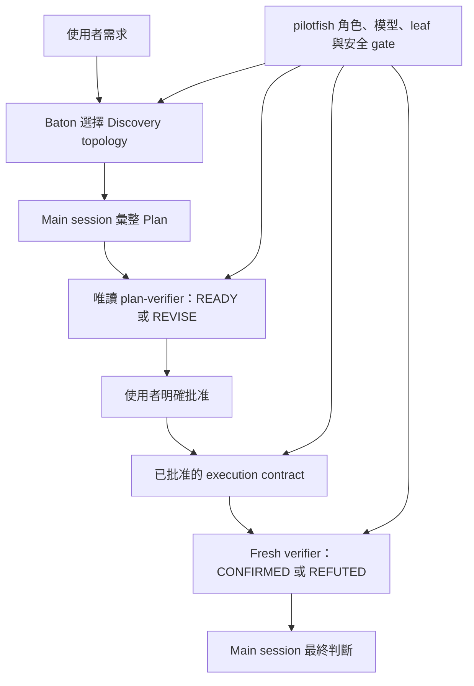

# pilotfish + Baton 相容性 Gate

## 目錄

- [目的](#目的)
- [合成契約](#合成契約)
- [隔離與重現](#隔離與重現)
- [精確 prompts](#精確-prompts)
- [已記錄的 v1.3.2 Opus 5 lifecycle](#已記錄的-v132-opus-5-lifecycle)
- [已記錄的 v1.3.2 sliced lifecycle](#已記錄的-v132-sliced-lifecycle)
- [已記錄的 v1.3.1 approval-lifecycle 結果](#已記錄的-v131-approval-lifecycle-結果)
- [已取代、失敗與被拒絕的 harness runs](#已取代失敗與被拒絕的-harness-runs)
- [限制與揭露](#限制與揭露)

## 目的

這項 benchmark 記錄 [Baton](https://github.com/cablate/baton) 在原生 first-party Claude 路由下的 compatibility 與 provenance Gates。新增的 v1.3.2 run 驗證一個 program envelope 與唯一 next executable slice；歷史 `final_gate` 保留 v1.3.1 approval lifecycle。Baton 負責 delegation topology；pilotfish 繼續掌管具名角色、角色模型、leaf-agent 邊界、approval、tool capabilities 與 verifier 詞彙。

> **Gate：** Discovery 可以發生在實作結果仍未知時，但 source write 必須等待 main-session Plan 與明確批准。Plan review 回覆 `READY` / `REVISE`；outcome review 回覆 `CONFIRMED` / `REFUTED`。這項 Gate 是 compatibility／provenance only：不建立效率、延遲、成本或 A/B 比較。

Fixture 是最早發佈於 pilotfish commit `5f027b8c` 的[雙 surface 研究 control](../dispatch-brake/positive-controls/research/fixture)。成功 run 使用 base HEAD `4d65cc94b59acec2debec37983ad0a021440d643`、Claude Code 2.1.217、原生 first-party Claude authentication、Fast mode 關閉、policy SHA `7ff86564…fb21`，以及 `SKILL.md` SHA-256 記錄於 [`results.json`](./results.json) 的 Baton skill。政策修正的現場依據是[田野報告](../../docs/field-report-tokscale-2026-07.zh-TW.md)：觀察來自 remora／GPT-5.6 routing，只支持 backend-neutral guardrails，不支持 native-Claude numeric optimization。

### 設計緣起

這個五階段 lifecycle 的直接設計來源之一，是 [Baton](https://github.com/cablate/baton) 原作者 [CabLate](https://github.com/cablate) 在 2026-07-13 討論大型 Legacy code 重構與 Agent 委派邊界時提出的流程。以下保留原始回覆：

> 大型的專案有個先決條件是把範圍訂下來，以我重構 Legacy code 的例子，Baton 會根據我當下的需求與該階段的目標，先派出研究用的 agent 理解專案現況，並分析後續要怎麼委派。
>
> 所以一個比較理想的流程應該是要這樣：
>
> 使用者提出一個需求
>
> -> 透過 Baton 去規劃如何委派 Agent 理解這個需求
>
> -> Agent們捕獲到實際情況回來後，主 session 撰寫一份 Plan
>
> (這過程為了詳細驗證 Plan 的可靠性，Baton可能還是會委派驗證用的 Agent)
>
> -> 使用者允許 Plan 執行，Baton 根據 Plan 執行最佳委派方案

— [CabLate](https://github.com/cablate)，2026-07-13

這段流程後來被具體化為 Discovery → Plan → Approval → Execution → Verification，並成為下方合成契約的骨架。

## 合成契約



| Layer | 掌管 | 不得覆寫 |
|---|---|---|
| Baton | 問題、topology、worker 數、ownership、順序、budget、stop condition | 具名角色模型、approval、verifier capability、leaf 邊界 |
| pilotfish | 具名角色、角色模型、tool allowlist、phase gate、approval contract、verifier 詞彙 | Baton 在 gate 內的 topology 判斷 |
| Main session | 證據整合、Plan 彙整、integration、最終判斷 | 必要 approval 或獨立 verification |

## 隔離與重現

測試 fixture 使用可丟棄的 Git repo。這項 approval-lifecycle run 使用的 exact historical v1.3.1 policy 與八角色 session JSON 已提交於 [`final-gate-snapshot/`](./final-gate-snapshot/)；[`build-agents-json.py`](./build-agents-json.py) 會把 role files 轉成注入的 `--agents` payload。這既避免覆寫已安裝的全域 pilotfish files，也讓該 runtime-tested working-tree snapshot 可稽核。User memory 仍疊在較具體的 project policy 下方，並列為限制；session-scoped roles 在這次 run 取代了 user role definitions。

> ⚠️ **安全界線：** `--dangerously-skip-permissions` 只用在可丟棄 fixture。不要在不可信或有價值的 checkout 使用。

```bash
SOURCE=/path/to/pilotfish-checkout
ROOT="$(mktemp -d /tmp/pilotfish-baton-gate.XXXXXX)"
WORK="$ROOT/fixture"
SNAPSHOT="$SOURCE/benchmarks/baton-compatibility/final-gate-snapshot"

mkdir -p "$WORK"
cp -R "$SOURCE/benchmarks/dispatch-brake/positive-controls/research/fixture/." "$WORK/"
cp "$SNAPSHOT/CLAUDE.md" "$ROOT/CLAUDE.md"
git init -q "$WORK"
git -C "$WORK" add .
git -C "$WORK" -c user.name=pilotfish-gate \
  -c user.email=pilotfish-gate@example.invalid commit -qm baseline

AGENTS_JSON="$(cat "$SNAPSHOT/agents.json")"
SESSION_ID="$(python3 -c 'import uuid; print(uuid.uuid4())')"
cd "$WORK"
```

保留 user setting source 是刻意的：Baton 安裝在使用者 skill 目錄。排除 `user` 時，Skill tool 會回覆 `Unknown skill`。Project 層 candidate policy 比 user memory 更具體；session-scoped `--agents` definitions 也高於 user agent files。

```bash
claude --dangerously-skip-permissions \
  -p --output-format json --max-budget-usd 6 \
  --session-id "$SESSION_ID" --model opus --effort high \
  --setting-sources user,project,local --strict-mcp-config \
  --agents "$AGENTS_JSON" \
  "$(cat "$SOURCE/benchmarks/baton-compatibility/prompts/turn-1.txt")"

claude --dangerously-skip-permissions \
  -p --output-format json --max-budget-usd 6 \
  --resume "$SESSION_ID" --model opus --effort high \
  --setting-sources user,project,local --strict-mcp-config \
  --agents "$AGENTS_JSON" \
  "$(cat "$SOURCE/benchmarks/baton-compatibility/prompts/turn-2.txt")"
```

這個 fixture 驗證了 runtime policy composition 與精確角色定義。[`final-gate-snapshot/CLAUDE.md`](./final-gate-snapshot/CLAUDE.md) 直接以 repo 內 bytes 計算 hash；`agents.json` 透過 shell command substitution 讀取，注入與計算 hash 前會去掉檔案尾端 newline。因 shell command substitution 也會移除 prompt 檔案尾端 newline，[`results.json`](./results.json) 分別記錄每個 prompt file SHA-256 與正規化 runtime-input SHA-256，連同 invocation evidence。Gate 不另外驗證 global file discovery 或 installer；後兩者仍由 installer review path 與 policy contract tests 覆蓋。

## 精確 prompts

| Turn | Prompt | 必要停止點 |
|---|---|---|
| Discovery + Plan | [`prompts/turn-1.txt`](./prompts/turn-1.txt) | Baton 已載入、零寫入、唯讀 `plan-verifier` 只用 `READY` / `REVISE`，接著等待批准 |
| 批准 + execution | [`prompts/turn-2.txt`](./prompts/turn-2.txt) | 只有 `REPORT.md`、測試通過、fresh outcome verifier 回 `CONFIRMED` |

## 已記錄的 v1.3.2 Opus 5 lifecycle

Claude Code 2.1.219 載入提案中的 `model: "opus"` settings、未改動的
v1.3.2 policy、目前生成的八角色 payload，以及安裝中 Baton skill 的
project-local 副本。這次刻意排除 user setting source：被拒絕的 attempt
與額外明確指定 `--model opus` 的 probe，在包含該 source 時都解析成
Opus 4.8。這是 setting source 相關的差異紀錄，不是已證明的根因。

| Invocation | Client duration / summed API time | Cost field / turns | 結果 |
|---|---:|---:|---|
| Plan | 408.315 / 562.239 s | $2.66763805 / 7 | 兩個 background Haiku scouts 完成；ENV 與 S1 各回一次 `REVISE`，修訂後 fresh Opus 5 `plan-verifier` 都回 `READY`；零寫入 |
| 已批准 S1 | 34.671 / 292.368 s | $1.4412844 / 3 | Sonnet writer 被既有 report-file guard 擋下；main 只整合 `REPORT.md`；`npm test` 通過且 Opus 5 verifier 回 `CONFIRMED`，但 main 隨後又改了一個 clause |
| Corrective final-byte verification | 10.867 / 115.184 s | $1.4398525 / 2 | 零寫入；`npm test` 通過；新的 Opus 5 verifier 對 SHA `bcbc74b7…93e1` 回 `CONFIRMED` |
| **成功 lifecycle 合計** | **453.853 / 969.791 s** | **$5.54877495 / 12** | **3 次 CLI invocation 後通過；S2 維持 deferred** |

Client 的 `duration_ms` 不包含部分 tracked background wait，而 API 欄位
會加總彼此重疊的 agents；兩欄都不當成端到端 wall-time 測量。原本兩次
CLI 的形狀**沒有**通過：第一個 outcome verdict 後又發生編輯，導致
final-byte coverage 失效，所以必須加第三次 invocation。`results.json`
保留這個 sequencing defect，沒有把 corrective verifier 塞回 Turn 2。
最後 repository-owned test、scope check、SHA check 與 fresh verifier
覆蓋的是同一份 bytes。

被拒絕的 user-source attempt 在 approval 前停止，Opus 4.8 花費
$1.5908975；明確 route probe 另花 $0.169445。連同成功 lifecycle，
有紀錄的 Opus-default 驗證 campaign client cost field 合計
$7.30911745。這些是單次觀察，不是 invoice 或比較性能結果。這輪沒有
觸發 `fallbackModel`、security routing 或 Fable。

## 已記錄的 v1.3.2 sliced lifecycle

Claude Code 2.1.218 使用精確
[`v1.3.2-gate-snapshot`](./v1.3.2-gate-snapshot/)，以及版本化的
[Turn 1](./prompts/v1.3.2-turn-1.txt) 與
[Turn 2](./prompts/v1.3.2-turn-2.txt) prompts。

| Turn | Wall / API time | Cost field / turns | 結果 |
|---|---:|---:|---|
| Plan | 273.977 / 273.017 s | $1.49627725 / 15 | Baton 載入；`ENV-report-audit` 再 `S1-report` 取得 foreground Opus `READY`；零寫入 |
| 已批准 S1 | 171.033 / 170.399 s | $1.2808205 / 4 | 只有 `REPORT.md`；`npm test` 與獨立 final-byte rerun 通過；fresh Opus verifier 回 `CONFIRMED` |
| **合計** | **445.010 / 443.416 s** | **$2.77709775 / 19** | `S2-followup` 維持 deferred |

`results.json#v1_3_2_release_gate` 以 SHA-256 綁定 snapshot、
shell-normalized payload、prompts、transcript、fixture baseline 與最終報告。
這筆單次 run 只建立其實際跑過的 sliced lifecycle，不代表成本、延遲、
品質或 activation frequency。

## 已記錄的 v1.3.1 approval-lifecycle 結果

`results.json` 將 `final_gate_status` 設為 `complete`，v1.3.1 approval-lifecycle `final_gate` 是通過的 invocation-granularity record。成功 run 使用 base HEAD `4d65cc94b59acec2debec37983ad0a021440d643`、Claude Code 2.1.217、原生 first-party authentication、明確 `--model opus` 與 Fast mode 關閉。

| Turn | Prompt file SHA-256 | Wall time | API time | Client-reported cost | API turns | 結果 |
|---|---|---:|---:|---:|---:|---|
| Turn 1：Discovery + Plan | `45dbe7b6…fcca7` | 168.410 s | 165.928 s | $1.104294 | 8 | Baton loaded；main session 直接唯讀；零寫入；`READY` |
| Turn 2：approved execution + verification | `82d83309…1918e7` | 278.340 s | 275.037 s | $1.7779397 | 5 | 只有 `REPORT.md`；`npm test` 通過；`CONFIRMED` |
| **合計** | | **446.750 s** | **440.965 s** | **$2.8822337** | **13** | 精確兩次 CLI invocation 通過 |

Turn 1 載入 Baton；Baton 判定這個小型 fixture 拆分後沒有正 net benefit，因此選擇 main session 直接 discovery。可丟棄 repository 在 approval 前保持 clean、零寫入。唯讀 `plan-verifier` 省略 invocation-level `model`，實際使用 Opus 4.8，第一份 Plan 就回覆 `READY`。Turn 2 呼叫一個 foreground `mech-executor`（實際 Sonnet 5），再呼叫 fresh `verifier`（實際 Opus 4.8）；兩個具名 call 都省略 invocation-level `model`。

既有 hook 拒絕 worker 的直接 `Write`，要求它把 findings 以文字交回。Worker 回傳完整報告內容，main session 在不改 scope 的前提下整合成 `REPORT.md`。唯一 fixture 變更是未追蹤的 `REPORT.md`，`npm test` 通過，outcome verdict 為 `CONFIRMED`。Verifier 揭露一個不阻斷的 wording 問題：`architecture.md:72-78` 含兩個非角色 row，因此把整個範圍稱作逐角色 tier table 稍微過寬；`CONFIRMED` 後沒有修改 fixture。

| Runtime provenance | 值 |
|---|---|
| Policy 與 snapshot SHA-256 | `7ff86564cd4cd8469cf3d24646fd395c57be09dc1fc7e1efa9d0d77c61ecfb21` |
| Shell-stripped 歷史 `agents.json` SHA-256 | `e901e16abdca03ea5f55e3d86f8726fcfa984488305e304c7a382426cd6b7c61` |
| 最近一次完成行為驗證的 policy SHA-256 | `d7fc88bf7903c2f70581068bfe3c4decea16cbb6470f860907bb856a2d718364`（[不可變 snapshot](../spontaneous-dispatch/compact-policy-gate-snapshot/CLAUDE.md)，已由 [compact-policy full matrix](../spontaneous-dispatch/README.zh-TW.md#adaptive-interaction-routing-gate) 驗證） |
| 目前產生的 v1.3.10 agents payload SHA-256 | `b5dc352f526f0c6f1985c67799f547c3368b2b72e77be1738a8789c542ae7bfc`（與 issue #29 recovery Gate 已 exercise 的 v1.3.8 payload 相同） |
| Turn 1 prompt file SHA-256 | `45dbe7b6b24cb5838ebf4219011797b61f172fcc18f0ca5039144017e93fcca7` |
| Turn 1 runtime-input SHA-256 | `d2ad46b7ecfb503f8f7185d6d68f404d326f1a4a480b9141d1a80318a746bb73` |
| Turn 2 prompt file SHA-256 | `82d833090ba91982651de9ac4beed8fc96311119c6eb9c6f0304c292821918e7` |
| Turn 2 runtime-input SHA-256 | `93ae95d1cd4eebca91ab42a06d484e180f46dd1f327e471a5a4fd2a27ca2f344` |
| Final transcript SHA-256 | `6563b1c5f3d15f2640688a8509fa093364c5534f9246e0ee700e67c3469ac0b5` |

這項 Gate 只建立 compatibility／provenance，不宣稱 Fable coverage，也不建立原生 Claude 的效率比較結論。政策的現場依據來自 remora／GPT-5.6 routing 的 field observations，只支持 backend-neutral anti-churn guardrails，不建立 native-Claude threshold、效率改善或 A/B 結論。

上面的 historical runtime record 早於 v1.3.6 policy 與 role-prompt bytes，
不能當作目前 candidate 的 behavioral evidence。另一份
[verifier-boundary Gate](../verifier-boundary/README.zh-TW.md) 釘選目前
policy／payload，並以 additive record 保存原生 Claude schema lifecycle、
routine-docs control、失敗嘗試與 claim limits。

## 已取代、失敗與被拒絕的 harness runs

上一筆 v1.3.0 final Gate 完整保留在 [`results.json`](./results.json) 的 `previous_final_gate`，包含兩次 invocation、role calls、metrics 與 transcript hash。精確 snapshot 可從 commit `4d65cc94b59acec2debec37983ad0a021440d643` 取回；它是與已記錄 v1.3.1 approval-lifecycle Gate 分開的歷史證據。

該 compatibility cycle 的第一次嘗試保留為 [`results.json`](./results.json) 的 `failed_candidate_gate`，沒有靜默丟棄或改標為 rejected。它使用舊 Turn 1 prompt，在 client budget 用盡後以 `budget_exhausted` 終止：218.040 秒、13 API turns、$4.12912975。Baton 已載入、tree 保持 clean，唯讀 `plan-verifier` 回覆 `READY`，但舊 prompt 沒有要求 approved turn 呼叫 closing outcome verifier。因此失敗同時記錄 budget exhaustion 與 acceptance-contract ambiguity；之後修正 prompt 才完成成功 Gate。

| 失敗嘗試證據 | 值 |
|---|---|
| Turn 1 prompt file SHA-256 | `edce6a591e5879769b89b0fff0f4aa8c64e038f79b93e6a804161e4f9914624f` |
| Turn 1 runtime-input SHA-256 | `8aa4459acbb2f96df4617dcbf2b147c91222252a48c8fac754f344bc2d32d2fb` |
| Transcript SHA-256 | `250b8cd8b53e758299b233d16c2753890a46c6284a99a8d21ba5d5e907bf7ebc` |
| Wall time / API time | 218.040 s / 186.738 s |
| Client-reported cost / API turns | $4.12912975 / 13 |
| Terminal disposition | `budget_exhausted`；零寫入；`READY` 但缺 closing outcome verifier |

2026-07-20、commit `40f3815` 的 v1.3.0 candidate 保留在 [`results.json`](./results.json) 的 `superseded_candidate_gate`。它在當時完成 lifecycle，但其 policy bytes 在已記錄的 v1.3.1 approval-lifecycle Gate 前已被替換，因此不是該 cycle 選定的 final evidence。三筆 additive CLI invocation records 保留了中斷行為：

| CLI invocation | Logical prompt | Wall time | Client-reported cost | API turns | 處置 |
|---:|---|---:|---:|---:|---|
| 1 | Turn 1：Discovery + Plan | 159.032 s | $1.8466575 | 18 | 完成；`READY` |
| 2 | Turn 2：approved execution | 46.941 s | $1.081003 | 2 | `REPORT.md` 後因訂閱模型額度上限中斷 |
| 3 | Turn 2 resumed | 85.021 s | $1.67602825 | 3 | 完成；`npm test` 通過且 `CONFIRMED` |
| **合計** | | **290.994 s** | **$4.60368875** | **23** | Superseded candidate，不是該 cycle 選定的 final evidence |

舊 candidate 使用 main session 直接 discovery，唯讀 `plan-verifier` 對第一版 Plan 回 `READY`，由 main session 只寫入 `REPORT.md`，再由 fresh outcome verifier 回 `CONFIRMED`。Turn 2 因啟用 usage credits 後，以同一 session ID 與逐字 prompt 續跑。中斷、三筆 invocation metrics 與舊 candidate hashes 都保留在 [`results.json`](./results.json)；它們不是目前 policy 的 final-gate metrics。

較早的完整 Gate 讓同一個雙 mode `verifier` 同時負責 Plan 與 outcome review。它當時通過（494.933 秒、$3.906375、12 turns），但 Codex review 指出 Plan 與批准前 security 邊界只靠 prompt。它現在是 summary-only 的 `superseded_gate`；精確 inputs 仍保留於 [`gate-snapshot/`](./gate-snapshot/)。

v1.2.1 release Gate（368.395 秒、$3.710435、17 turns）以 summary-only 的 `previous_release_gate` 保留於 [`results.json`](./results.json)，並可由 Git commit `80b5d1f` 重現。v1.2.0 release Gate（448.148 秒、$3.789048、22 turns）已從 Git commit `1251465` 還原為 summary-only 的 `historical_release_gate`；沒有杜撰 invocation detail。

第一次隔離嘗試不列入相容性證據。它使用 `--setting-sources project,local`，因此看不到安裝在 user 層的 Baton skill。該 run 沒有測到指定 composition，也沒有啟動批准回合。

| 證據 | 值 |
|---|---:|
| Wall time | 213.558 s |
| Client-reported cost | $1.627875 |
| API turns | 17 |
| Git state | Clean |
| 處置 | Turn 2 前拒絕 |
| Raw transcript SHA-256 | `64376ea52a4e67192df29d8595c180ddc5017638029759a8ac13aff87d5cca81` |

公開這次拒絕，是因為 dependency 根本沒載入時，其他行為即使通過也不能算相容性證據。

## 限制與揭露

> **不要把單次 compatibility run 外推成通用效能主張。** 已記錄的 v1.3.1 approval-lifecycle Gate 只為其 historical bytes 建立一條有效 lifecycle 與 exact-byte provenance，不是 optimization experiment。

| 限制 | 影響 |
|---|---|
| 單次成功的 native run | 時間與 cost 是觀察值，不是母體估計或 provider invoice |
| Remora／GPT-5.6 field provenance | 報告支持 backend-neutral failure-mode guardrails，不支持 native-Claude numeric threshold 或 efficiency A/B 結論 |
| Client-reported cost field | 不是 provider invoice；失敗與 superseded candidate 的成本都是歷史觀察 |
| 小型 fixture | 本次 Baton 將 discovery 留在 main session，並選擇一個 foreground mechanical writer；大型任務可能選擇不同 topology |
| 動態角色注入 | 已驗證精確 policy、role 與 prompt bytes，但 global agent-file discovery 仍不在這個 compatibility fixture 範圍 |
| Runtime background result collection | 已記錄的 v1.3.1 approval-lifecycle Gate 沒有 discovery fan-out；保留的 v1.3.0 `previous_final_gate` 曾實際收集兩個 background scouts |
| 未觸發的 security／long-process 路徑 | Tool allowlists、policy tests 與 contributor 專門實測涵蓋其 contract；本 fixture 不宣稱 runtime coverage |
| Candidate project memory 疊加 user memory | 較具體的 candidate policy 管理 fixture；managed policy 或矛盾的 project instruction 仍可能改變行為 |
| 單一 Claude Code 2.1.217 target | 其他 Claude Code 版本仍需自己的 smoke test |
| 失敗 candidate 的 prompt ambiguity | 舊 prompt hash 與 budget exhaustion 都保留；成功 Gate 使用修正後 prompt |
| Verifier wording note | `architecture.md:72-78` 含兩個非角色 row，因此把整段稱為逐角色 tier table 稍微過寬；`CONFIRMED` 後沒有修改 fixture |
| 本 session 無法使用 Fable | Gate 明確使用 Opus，不宣稱 Fable coverage 或效率 |
| Raw transcript 未提交 | 內含本機絕對路徑與 session metadata；改為公開 prompts、正規化 calls、content hashes、metrics 與 verdicts |
| Gate 之後的角色 frontmatter 變動（[#18](https://github.com/Nanako0129/pilotfish/issues/18)） | 這次 Gate 跑完之後，`executor` 的 model 從 Opus 改成 Sonnet。已提交的歷史 `agents.json` 仍與當時實際 runtime input 完全一致；目前產生的 release payload 與其 hash 另行記錄。這次 Gate 的 turns 從未派送過 `executor`，所以上面的 transcript、cost、verdict 對它實際跑過的角色仍然準確。後續 live replays 接受 changed payload，但派出的是 `mech-executor` 或 `scout`，不是被修改的 `executor`；該 role 仍沒有 dedicated live Gate。詳見 `results.json` 的 `post_gate_role_frontmatter_change` |
